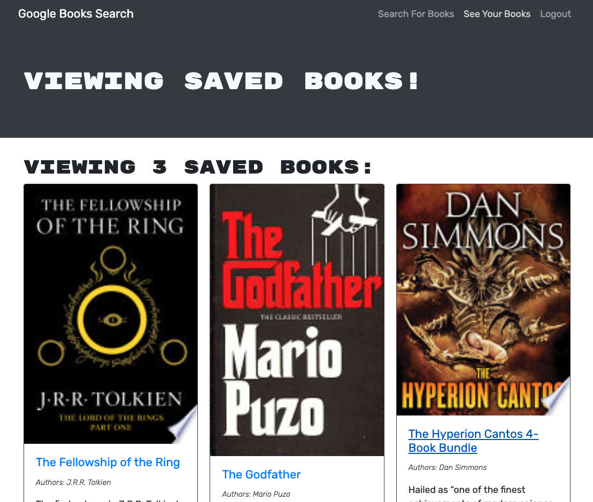

# Book Search Engine

## Overview

An app that wraps Google Books' search to allow the user to select and save books in a list for future reading.

## Features

The app presents users with a simple book search form, which returns results from Google Books. Upon first visiting, a user may perform a search, log in, or sign up, using the links and search form in the page header/navigation area. Results of the search are displayed below the search form. If the user is not logged in when their search is executed, the results displayed include only book information, including title, author(s), an image of the book's cover, and a description, with the title and image linked to the books information page on Google Books. If the user is logged in, each result also includes a button to "Save this book" to the user's list, or to remove it, if it has alredy been saved.

In the saved books view, the user is presented with the list of books they have saved, displayed similarly to the results on the book search page. To remove a book from the saved list, the user can click the button below the description.

;

## Technology

The app uses a Node/Express server and a Mongo database on the back end, with Apollo Server Express and GraphQL powering the API. The front end is implemented using React and Apollo Client to connect with the GraphQL API. The app uses JSON Web Tokens for user authentication.

## Links
* See it here: https://book-bookmarks.herokuapp.com/
* GitHub: https://github.com/costanza13/book-search-engine

* [Apollo Server/Client](https://www.apollographql.com/)
* [JWT](https://www.npmjs.com/package/jsonwebtoken)